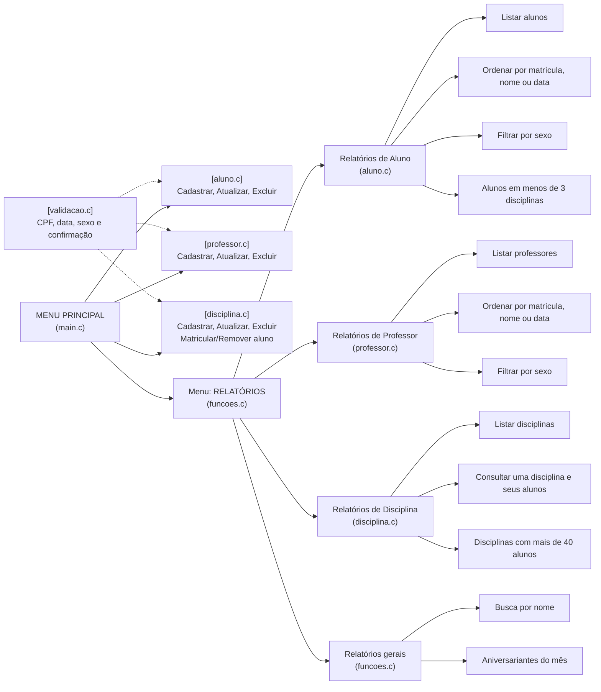

# Projeto Escola

Programa em C para controlar o funcionamento de uma escola: cadastro de alunos, professores, disciplinas e diversos relatórios.

Atividade extra de **INF029 — Laboratório de Programação**, do IFBA, com o professor Renato Novais.

O programa funciona pelo terminal e os dados ficam armazenados apenas na memória. Portanto, ao fechar o programa, os dados cadastrados são perdidos.

---

## Quem fez o quê

Dividimos o projeto por módulos para facilitar o desenvolvimento e evitar conflitos entre os arquivos:

- **Guilherme** — `aluno.c` / `aluno.h`
- **Luiza** — `professor.c` / `professor.h`
- **Vitor** — `disciplina.c` / `disciplina.h` e `validacao.c` / `validacao.h`

Os arquivos `main.c` e `funcoes.c`, que contêm os menus, leituras de dados e relatórios gerais, foram modificados por todos os integrantes.

---

## Como executar o programa

### 1. Clonar o repositório

```bash
git clone https://github.com/euvitorcarvalho/projetoescola.git
```

Entre na pasta do projeto:

```bash
cd projetoescola
```

### 2. Compilar o programa

Utilize o seguinte comando:

```bash
gcc -o escola main.c aluno.c professor.c disciplina.c funcoes.c validacao.c
```

Para compilar utilizando avisos adicionais do compilador:

```bash
gcc -Wall -o escola main.c aluno.c professor.c disciplina.c funcoes.c validacao.c
```

### 3. Executar o programa

No Linux ou macOS:

```bash
./escola
```

No Windows:

```bash
escola.exe
```

---

## Estrutura dos arquivos

```text
main.c
    Inicializa os vetores e executa o menu principal.

aluno.c / aluno.h
    Estrutura ALUNO, cadastro, atualização, exclusão,
    ordenações e filtros de alunos.

professor.c / professor.h
    Estrutura PROFESSOR, cadastro, atualização, exclusão,
    ordenações e filtros de professores.

disciplina.c / disciplina.h
    Estrutura DISCIPLINA, cadastro, atualização, exclusão,
    matrícula e remoção de alunos, além dos relatórios
    relacionados às disciplinas.

funcoes.c / funcoes.h
    Menus, estrutura DATA, leitura de strings e datas,
    além dos relatórios gerais.

validacao.c / validacao.h
    Validação de CPF, sexo, data e confirmação de S/N.
```

---

## Desenho do programa



---

## Funcionalidades implementadas

### Cadastros

- **Cadastro de alunos** — Matrícula, nome, sexo, data de nascimento e CPF.
- **Cadastro de professores** — Matrícula, nome, sexo, data de nascimento e CPF.
- **Cadastro de disciplinas** — Nome, código, semestre e professor responsável.
- **Atualização de disciplinas.**
- **Exclusão de disciplinas.**
- **Inserção de alunos em disciplinas.**
- **Exclusão de alunos de disciplinas.**

---

## Relatórios

- Listar alunos.
- Listar professores.
- Listar disciplinas sem os alunos matriculados.
- Consultar uma disciplina com seus alunos matriculados.
- Listar alunos por sexo.
- Listar alunos ordenados por nome.
- Listar alunos ordenados por data de nascimento.
- Listar professores por sexo.
- Listar professores ordenados por nome.
- Listar professores ordenados por data de nascimento.
- Listar aniversariantes do mês.
- Buscar pessoas por parte do nome, com no mínimo três letras.
- Listar alunos matriculados em menos de três disciplinas.
- Listar disciplinas com mais de 40 alunos matriculados.

---

## Validações

O programa possui validações para:

- CPF:
  - Quantidade de caracteres.
  - Entrada composta apenas por números.
  - Verificação de dígitos repetidos.
  - Verificação dos dígitos verificadores.

- Sexo:
  - Aceita letras minúsculas.
  - Converte a entrada para o formato utilizado pelo sistema.

- Confirmações:
  - Validação de respostas `S` ou `N`.

- Data de nascimento:
  - Possui estrutura para leitura e validação, mas ainda pode ser aprimorada.


## Tecnologias utilizadas

- Linguagem C.
- GCC.
- Git e GitHub.
- Execução pelo terminal.
- Estruturas, vetores, funções e ponteiros.
