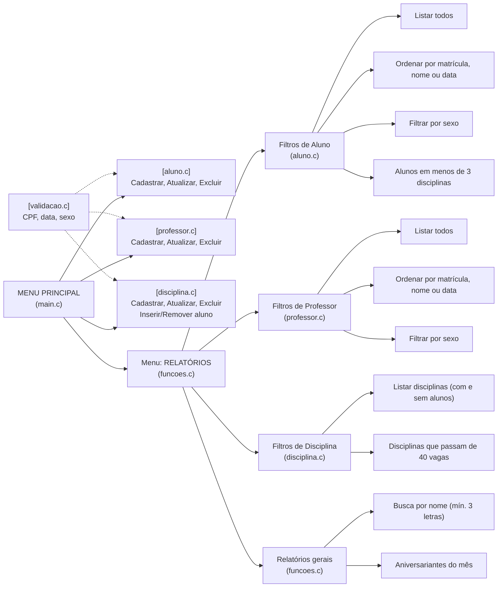

# Projeto Escola
 
Programa em C pra controlar o funcionamento de uma escola: cadastro de alunos, professores, disciplinas e um monte de relatório em cima disso. Atividade extra de INF029 (Laboratório de Programação), IFBA, com o professor Renato Novais.
 
Tudo roda no terminal e os dados ficam só na memória, então fechou o programa, perdeu tudo.
 
## Quem fez o quê
 
Dividimos por módulo pra não ficar um mexendo no arquivo do outro e dando conflito toda hora:
 
- **Guilherme** - `aluno.c` / `aluno.h`
- **Luiza** - `professor.c` / `professor.h`
- **Vitor** - `disciplina.c` / `disciplina.h` e `validacao.c` / `validacao.h` <br>
O `main.c` e o `funcoes.c` (menus, leitura de dados e os relatórios que misturam aluno com professor) acabaram sendo mexidos por todo mundo.
 
## Compilando e rodando
 
```
gcc -o escola main.c aluno.c professor.c disciplina.c funcoes.c validacao.c
./escola
```
 
No Windows o executável sai como `escola.exe`. Se quiser ver os avisos do compilador é só jogar um `-Wall` no meio.
 
## Os arquivos
 
```
main.c            monta os vetores de aluno e professor e roda o loop do menu
aluno.c/.h        struct ALUNO, cadastrar/atualizar/excluir, ordenações e filtros
professor.c/.h    a mesma coisa do aluno, só que pra professor
disciplina.c/.h   ainda praticamente vazio, é o que falta fazer
funcoes.c/.h      menus, struct DATA, leitura de string/data e relatórios gerais
validacao.c/.h    validação de CPF, sexo, data e confirmação de S/N
```
 
## Desenho do programa
 


## O que já funciona
 
- **Cadastro de Alunos** (Matrícula, Nome, Sexo, Data Nascimento, CPF) ✅
- **Cadastro de Professores** (Matrícula, Nome, Sexo, Data Nascimento, CPF) ✅
- **Cadastro de Disciplinas** (Nome, Código, Semestre, Professor) 🔴
  - Inserir/Excluir aluno de uma disciplina 🔴
- **Relatórios**
  - Listar Alunos ✅
  - Listar Professores ✅
  - Listar Disciplinas (sem os alunos) 🔴
  - Listar uma disciplina (com os alunos matriculados) 🔴
  - Listar Alunos por sexo ✅
  - Listar Alunos ordenados por Nome ✅
  - Listar Alunos ordenados por data de nascimento ✅
  - Listar Professores por sexo ✅
  - Listar Professores ordenados por Nome ✅
  - Listar Professores ordenados por data de nascimento ✅
  - Aniversariantes do mês 🔴
  - Busca de pessoa por pedaço do nome (mínimo 3 letras) 🟡
  - Alunos matriculados em menos de 3 disciplinas 🔴
  - Disciplinas que extrapolam 40 vagas 🔴
- **Validações**
  - CPF (tamanho, só número, dígitos repetidos e os dois dígitos verificadores) ✅
  - Sexo (aceita minúsculo e converte pra M/F/O) ✅
  - Confirmação S/N ✅
  - Data de nascimento 
  
## O que falta e o que a gente já sabe que tá errado
 
O grosso do que falta é disciplina. Ela é a única entidade que ainda não existe de verdade no código, e como vários relatórios dependem dela (listar disciplina, aluno com menos de 3 disciplinas, turma passando de 40 vagas), tudo isso caiu junto.
 
Fora isso:
 
- `validar_data()` existe mas só tem um `return 0` dentro, ou seja, aceita qualquer data. Falta checar quantidade de dias por mês, ano bissexto e um intervalo de ano que faça sentido.
- A busca por nome usa `strstr`, que diferencia maiúscula de minúscula. Procurar por "vitor" não acha "Vitor Carvalho". Já funciona, mas ainda não do jeito certo.
- `RelatorioAniversariantes()` está declarada e chamada, só que o corpo dela está vazio.
- O campo `contDisciplinas` já existe dentro do `ALUNO` esperando a parte de disciplina ficar pronta.
